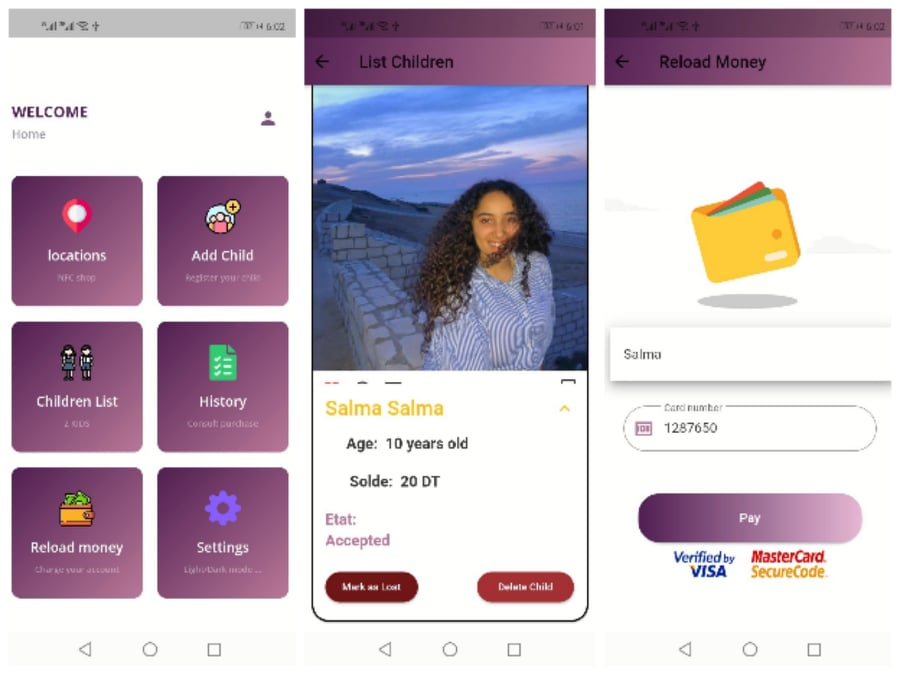

   
   

    Description:

Our solution intervenes to create a system allowing payment and parental control at the same time.

  Our project is mainly based on a space-saving NFC tag that will allow contactless payment to the trader. This tag is linked to a balance funded by parents. This feature already allows you to control the maximum amount spent by the child. In addition, the project foresees the development of an application for parents.

  Our project uses NFC technology to make the payment. After checking the balance, if it is enough, payment is made and the total of products purchased is displayed in the parents' application.

    Configuration:

  to run the application on your smartphone just put your IP address in the lib -> config -> dbconnection.dart file

